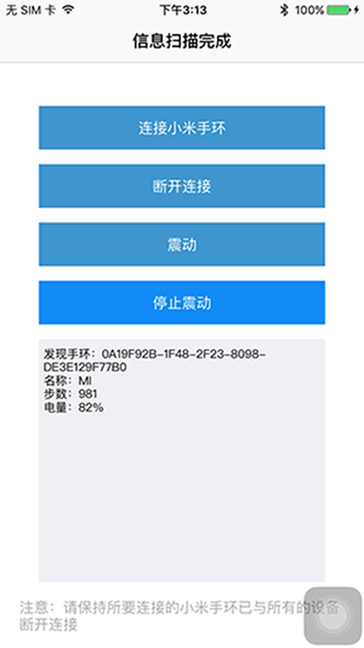

# BLE-miband
=========
>基本iOS BLE的小米手环测试。
 
## content
- 设备搜寻、连接
- 读取电量、步数数据
- 震动

## thanks
-  [https://github.com/paulgavrikov/xiaomi-miband-cocoa](https://github.com/paulgavrikov/xiaomi-miband-cocoa) (swift)
- [物联网安全拔“牙”实战——低功耗蓝牙（BLE）初探](http://drops.wooyun.org/tips/10109)
- [More](https://github.com/stormluke/Mili-iOS)

